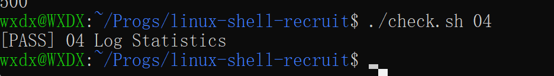
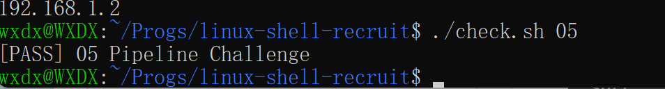
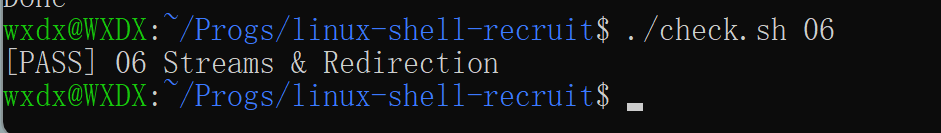
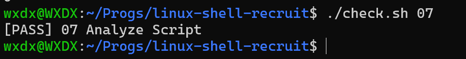

## Learning Notes
### Task 01 Project Hunt
学习目标：本任务主要学习了Linux中目录和隐藏文件的查看方式，以及相对路径的写法。

通过学习`ls`、`ls -a`、`ls -la`，我查看了目录内容，了解到以**.**开头的文件或目录属于隐藏项，普通`ls`查找不
能查找到，必须通过`ls -a`显示，而`ls -l`是展示文件或目录具体信息，可以通过每一项信息的第一个字符判断类型，
例如`-`通常表示文件，`d`通常表示目录。
而在相对路径中，`..`表示上一级目录，`.`表示当前目录，相对路径的不同目录之间需要通过`/`隔开。 

 
### Task 02 Missing Command
学习目标：学习Linux文件权限、PATH和Shell查找命令相关知识。

最开始任务无法运行，我通过`chmod +x tools/recruit-info`增加执行权限后，成功运行了该程序，但是此时仍面临
直接输入程序名称无法运行的情况。通过学习我了解到这是因为当我们直接输入不包含路径的外部命令时，Shell会按
照命令查找规则进行查找，其中会根据PATH中的指定目录寻找对应的可执行文件。而由于tools目录不在PATH中，所以
必须通过export临时将tools目录添加到当前的Shell的PATH中。
在这次任务的检查中还遇到过一个Fail问题，最后通过查看`check.sh`中的检查条件发现，是由于我在`answers/02.md`
的回答中还保留了模板提示语造成的，在删除提示语后顺利通过了检查。这个事情提示我有时候不一定是程序代码出现
了问题，这些小细节一样需要注意。

### Task 03 Code Search
学习目标：学习查找包含特定内容的文件，并对其进行按路径字典序排序、去重复的操作。

通过学习，我先使用`find`查看了workspace/project/目录下的文件，然后又通过`grep`搜索含有对应标记的子文件。
但此时只能对目标内容依次输入查找，所以我在学习后又加上了`-E`（拓展正则表达式），现在在`|`的配合使用下可以
做到同时输入查询多个关键内容。之后我使用`sort`对得到的文件路径进行字典序排序，并使用`uniq`去除可能重复的
路径。最后我通过`>`将结果保存到了output/03_code_search.txt中。

### Task 04 Log Statistics
学习目标：学习如何统计日志中特定内容的出现次数，找出出现次数最多的内容，以及如何对特定内容进行升/降排序。

我首先通过 `cat logs/server.log` 查看了日志内容，了解了日志中日期、时间、用户名和错误码等基本结构。
在任务一中，我使用 `grep "ERROR"` 筛选出了所有含有ERROR的日志，再通过 `wc -l` 统计日志条数，并使用 `>` 将
最终结果写入指定文件。
在任务二中，需要我找出所有产生过 ERROR 的用户名。我先通过`grep`筛选，再使用`cut`按照空格和`=`分割字段，并
从完整日志中逐步提取出用户名。之后使用`sort`按字典序排列，并通过`uniq`去除重复用户名。通过这一过程，我进一
步理解了`cut`中分隔符和字段的作用，也明白了`uniq`主要用于处理相邻的重复行，因此通常可以先通过`sort`将相同
内容排列到一起。
在任务三中，需要统计出现次数最多的错误码。在提取出含ERROR的日志中的错误码后，我使用`sort`将相同错误码排列
在一起，再通过`uniq -c`统计每个错误码出现的次数。之后使用`sort -nr`按出现次数从大到小排列，通过`head -n 1`
取得出现次数最多的一项，最后提取出错误码本身并保存到指定文件。
通过这次任务，我对Shell有了更深入的理解。一个较复杂的日志统计任务可以拆分成多个简单步骤，每个命令只完成
筛选、提取、排序或统计中的一部分，再使用`|`将这些命令连接起来。相比直接记住一整条长命令，我觉得理解每一步
数据发生了什么变化更加重要，也方便在遇到其他任务时根据实际需求重新组合命令。

### Task 05 Pipeline Challenge
学习目标：（1）巩固先前的学习内容；（2）学习理解Linux中`|`的用法，并通过'|'将多个命令连接起来直接完成整个
处理流程。

开始时，我先通过`cat logs/access.log`查看了日志内容。每一行由IP地址、访问路径和状态码组成，因此首先使用 
`cut -d ' ' -f 1` 提取第一列 IP 地址。在得到所有IP后，我又使用`sort`将相同的IP排列到一起，再通过`uniq -c`
统计每个IP出现的次数。之后使用`sort -nr`将所有IP按出现次数从大到小排序，使请求次数最多的IP排在第一行。最后我通过`head -n 1`取得第一行，再使用`awk '{print $2}'`提取其中的IP地址，并通过`>`将结果保存到`output/05_top_ip.txt`中。
通过这次任务，我对管道的理解更加清楚了。前一个命令的输出可以直接作为后一个命令的输入，不需要额外创建临时文
件。整个处理过程更加直观明了。

### Task 06 Streams & Redirection
学习目标：学习Linux中的标准输入、正常输出和错误输出，并学会输出重定向、错误重定向以及`tee`命令的用法。

我首先运行了`./tools/check-project`，观察到程序会同时产生正常信息和错误信息。通过学习了解到，程序的正常输
出属于`stdout`,而错误输出属于`stderr`。stdout的文件描述符为 1，stderr的文件描述符为 2。在任务一中，我使用
`>`将程序的stdout重定向到`output/06_stdout.txt`。执行后发现正常信息不再显示在终端，而错误信息仍然显示，这
说明`>`默认只重定向 stdout。
在任务二中，我使用`2>`将stderr重定向到`output/06_stderr.txt`。此时错误信息被保存到文件，而正常信息仍然显示
在终端。通过对比`>`和`2>`，我进一步理解了stdout和stderr的不同含义。
在任务三中，我使用`|`将程序的stdout传递给`tee`。`tee`可以把内容输出到终端的同时，将相同内容保存到文件，因
此实现了正常输出既显示在终端，又保存到`output/06_tee.txt`。
通过本次任务，我对 Linux 中的数据流和重定向有了更加直观的认识。程序的正常输出和错误输出虽然默认都会显示在
终端中，但实际上属于不同的数据流，可以分别进行重定向。同时，我也进一步理解了管道默认传递的是stdout，而不
是stderr。

### Task 07 Analyze Script
学习目标：本任务主要学习了`Bash`脚本的基本编写方法，并将前面任务中学习过的命令整合为一个可以重复使用
的脚本。同时学习了命令行参数、条件判断、变量、命令替换以及退出状态等基本概念。

首先，我了解到Bash脚本可以通过`$1`获取运行脚本时传入的第一个参数，而`$#`表示传入参数的数量。通过
`if [[ ... ]]`进行条件判断，可以检查出用户是否传入了参数；如果没有参数，则使用`echo`输出提示，并通过
`exit 1`以非零状态结束脚本。随后，我使用`[[ ! -f "$1" ]]`判断参数指定的文件是否存在。其中`-f`用于判断
目标是否为存在的文件，`!`表示对判断结果取反。当文件不存在时，脚本会输出错误提示并结束运行。在日志分析
部分，我将之前任务中学过的 `grep`、`cut`、`sort`、`uniq`、`head` 和 `awk` 等命令组合到脚本中。并通过
`$(...)`执行命令，同时将结果保存到变量，再使用`echo`将统计结果按照要求输出。这样就不会把日志文件路径
固定在脚本中，而是可以通过参数分析不同的日志文件。此外，我还通过`echo $?`对上一条命令的退出状态进行查
看。在测试中，没有参数和文件不存在时返回 `1`，正常分析日志文件时返回 `0`。
通过本任务，我对Bash脚本从接收参数、检查输入，到执行数据处理并输出结果的完整过程有了更清晰的理解。

