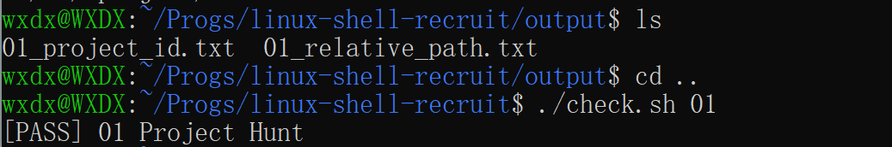
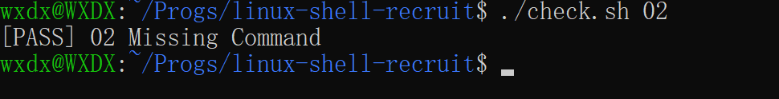
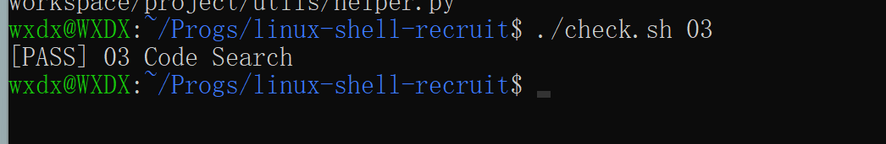

## Learning Notes
### Task 01 Project Hunt
学习目标：本任务主要学习了Linux中目录和隐藏文件的查看方式，以及相对路径的写法。
通过学习`ls`、`ls -a`、`ls -la`，我查看了目录内容，了解到以**.**开头的文件或目录属于隐藏项，普通`ls`查找不
能查找到，必须通过`ls -a`显示，而`ls -l`是展示文件或目录具体信息，可以通过每一项信息的第一个字符判断类型，
例如`-`通常表示文件，`d`通常表示目录。
而在相对路径中，`..`表示上一级目录，`.`表示当前目录，相对路径的不同目录之间需要通过`/`隔开。 

 
### Task 02 Missing Command
学习目标：学习Linux文件权限、PATH和Shell查找命令相关知识。
最开始任务无法运行，我通过`chmod +x tools/recruit-info`增加执行权限后，成功运行了该程序，但是此时仍面临
直接输入程序名称无法运行的情况。通过学习我了解到这是因为当我们直接输入不包含路径的外部命令时，Shell会按
照命令查找规则进行查找，其中会根据PATH中的指定目录寻找对应的可执行文件。而由于tools目录不在PATH中，所以
必须通过export临时将tools目录添加到当前的Shell的PATH中。
在这次任务的检查中还遇到过一个Fail问题，最后通过查看`check.sh`中的检查条件发现，是由于我在`answers/02.md`
的回答中还保留了模板提示语造成的，在删除提示语后顺利通过了检查。这个事情提示我有时候不一定是程序代码出现
了问题，这些小细节一样需要注意。

### Task 03 Code Search
学习目标：学习查找包含特定内容的文件，并对其进行按路径字典序排序、去重复的操作。
通过学习，我先使用`find`查看了workspace/project/目录下的文件，然后又通过`grep`搜索含有对应标记的子文件。
但此时只能对目标内容依次输入查找，所以我在学习后又加上了`-E`（拓展正则表达式），现在在`|`的配合使用下可以
做到同时输入查询多个关键内容。之后我使用`sort`对得到的文件路径进行字典序排序，并使用`uniq`去除可能重复的
路径。最后我通过`>`将结果保存到了output/03_code_search.txt中。

